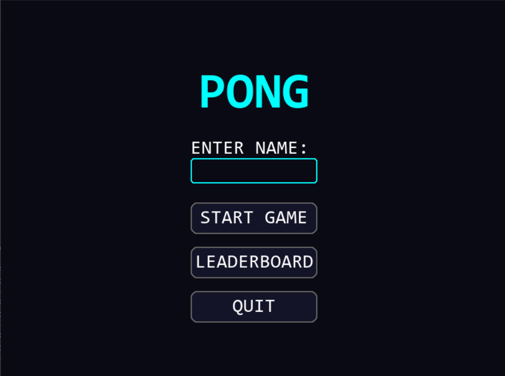
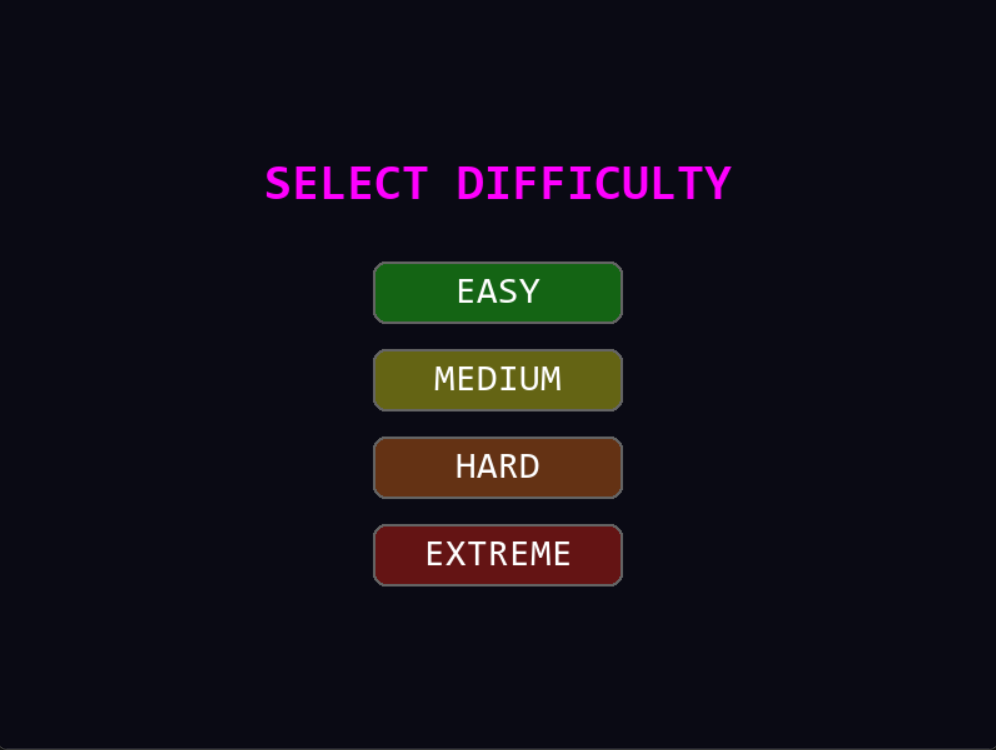
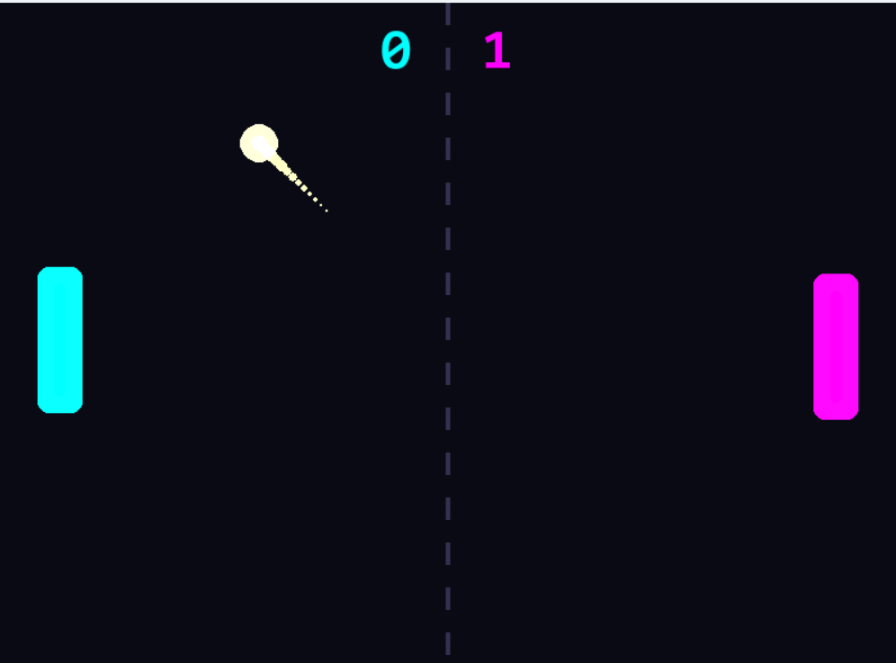
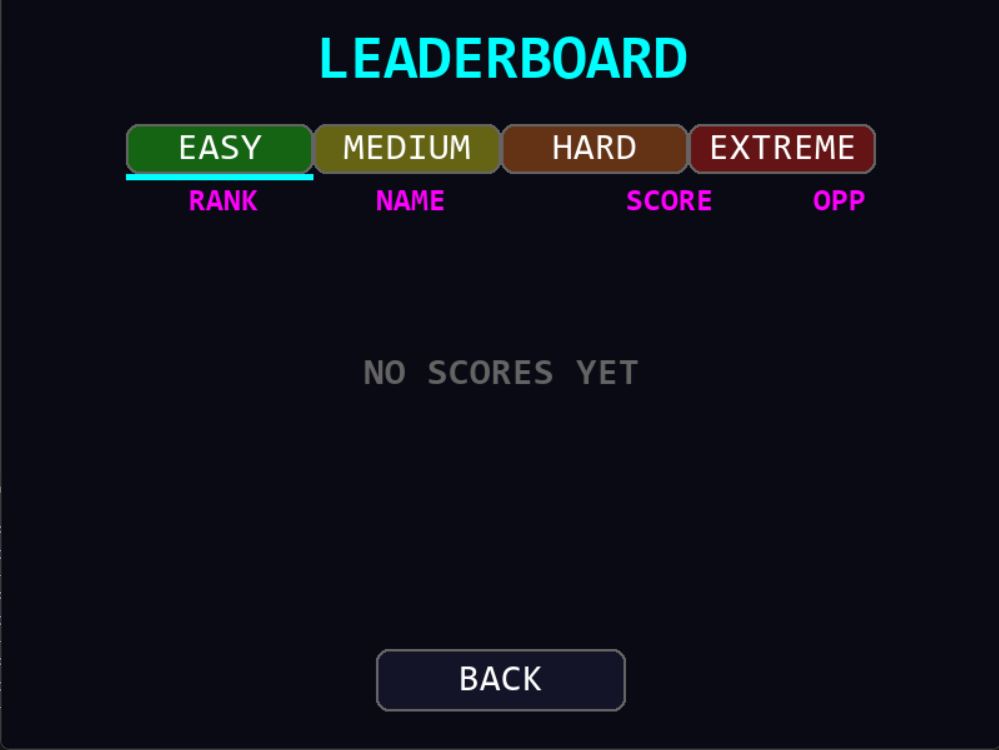

# 🏓 Pong: Cyberpunk Edition

A high-performance, visually stunning remake of the classic Pong game, featuring a sleek **Neon/Cyberpunk** aesthetic and advanced gameplay mechanics.

---

## ✨ Features

- **Rich Aesthetics**: Vibrant neon glow effects, dynamic ball trails, and procedural particle explosions.
- **Smart AI**: Four distinct difficulty levels, from the beginner-friendly "Easy" to the "Invincible" Extreme mode.
- **Persistent Leaderboard**: An encrypted high-score system that tracks your best runs across all difficulty levels.
- **Robust Physics**:
    - **Angle-based Reflection**: Bounce the ball based on where it hits the paddle.
    - **Speed Ramping**: The game gets faster with every hit (+1.0 speed per bounce).
    - **Slow Start**: Rounds start at a reactive speed (5.0) and jump to difficulty speed after the first serve.
    - **Anti-Tunneling**: Advanced predictive collision detection to prevent the ball from phase-shifting through paddles at high speeds.
- **Gamepad-Responsive**: Optimized for smooth keyboard input and responsive paddle control.

---

## 📸 Screenshots

| Main Menu | Difficulty Selection |
|:---:|:---:|
|  |  |

| Gameplay | Leaderboard |
|:---:|:---:|
|  |  |

---

## 🚀 How to Play

### 1. Standalone (Windows)
No Python installation required! Just download and run the binary:
- Navigate to the `dist/` folder.
- Run **`PONG.exe`**.

### 2. From Source
If you prefer running the script directly:
1. Ensure you have Python 3.12+ and Pygame installed:
   ```bash
   pip install pygame
   ```
2. Run the game:
   ```bash
   python main.pyw
   ```

---

## 🛠️ Tech Stack

- **Language:** Python 🐍
- **Library:** Pygame
- **Distribution:** PyInstaller (for single-file `.exe`)
- **Security:** XOR + Base64 Obfuscation for leaderboard data.

---

## 🎹 Controls

- **W**: Move Paddle Up
- **S**: Move Paddle Down
- **ESCAPE**: Pause / Menu
- **SPACE**: Continue (on goal or pause)

